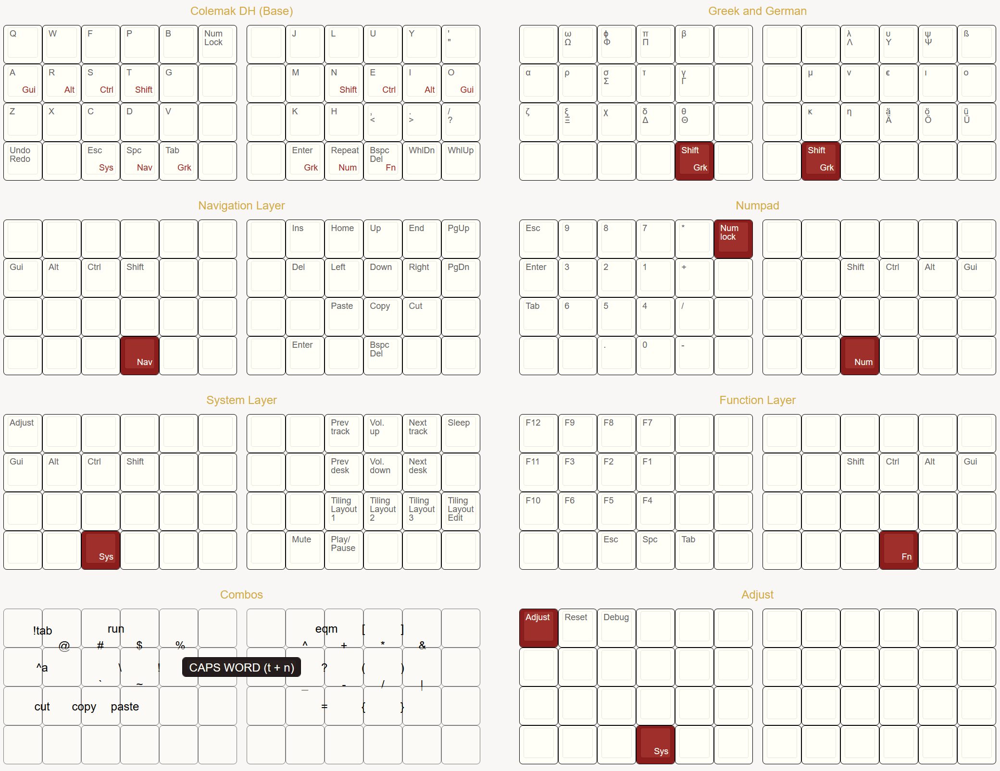

## Keymap configuration for OLKB Planck

- layout based on Miryoku with dual purpose keys on home row and on thumbs to hold modifiers and to access layers
- switch to toggle home row mods on/off on the fly 
- Callum OSM mods on navigation, number, system and function layers (always
  enabled, regardless of state of HRMs)
- super-repeat key on right home thumb: Acts as one-shot shift after space, enter and pausing for more than 800ms; acts as "t" or "n" after left- or right-shifted alphas; and otherwise it repeats the last input to reduce SFUs
- backspace morphs into delete when shifted
- caps word via combo (a smart caps lock
  that deactivates itself at the end of the word)
- unicode layer with Greek symbols for mathematical typesetting (shifted
  versions when both layer mods are held together)
- symbols and desktop shortcuts are accessed from the base layer via combos
- ergo mod aka the middle two columns do nothing (except for a num lock on row 1)
- the bottom left key is mapped to undo/redo (activated with my palm when hands are on the home row)
- the bottom right two keys are mouse wheel up/down for hands-off-keyboard browsing and for advancing slides in presentations

## Combos

- the arrangement is optimized for mathematical typesetting and programing
- vertical top row symbols use standard num row arrangement
  (except + and & being swapped)
- vertical bottom row symbols match the top row for easier
  memorization (superscript ^ and subscript _; + and -, * and
  /; logical operators & and |)
- holding down both index fingers (t + n) activates caps word 

## Requirements

The configuration requires the following commits merged into the local QMK
branch (or simply forking this branch)

- Bilateral combinations ([link](https://github.com/manna-harbour/qmk_firmware/issues/29)) + custom mod ([605ecc6](https://github.com/manna-harbour/qmk_firmware/commit/605ecc6c3b4141a930544ca4a35488d1497df967))
- Early combos ([PR 8591](https://github.com/qmk/qmk_firmware/pull/8591))
- Combo should trigger ([7c8b88e](https://github.com/sevanteri/qmk_firmware/commit/7c8b88e2e99ae5018fdb11cfda59bbe71360380b))
